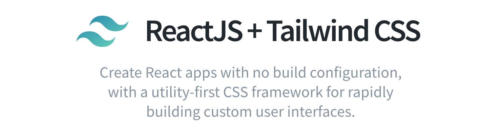

# Create React App + Tailwind CSS
## (with Purgecss, Autoprefixer, CSSNano and postcss)
It's [Create React App](https://github.com/facebook/create-react-app) but with Tailwind CSS config, ready to use  

<div align="center">
    
</div>

Create React apps with no build configuration.

- Included with [TailwindCSS](https://tailwindcss.com)
- Included with [PurgeCSS](https://www.purgecss.com)

## Installation

```bash
git clone  my-app
cd my-app
npm run start  // for live reloading (also reloads everytime you change tailwind config)
npm run build  // for production (purges unused CSS and minifes and adds prefixes)
```

Thanks!
